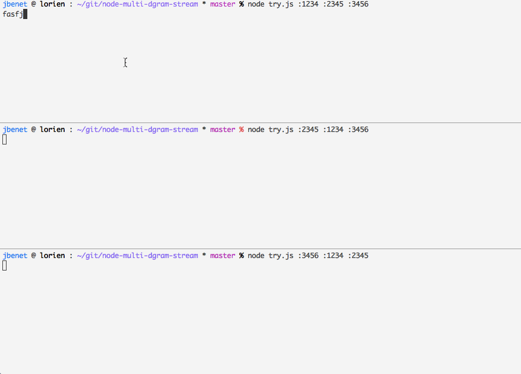

# multi-dgram-stream

Connect [dgram-stream](http://github.com/jbenet/dgram-stream) to a set of endpoints. Unicast all messages to them.


## Example

```
cat try.js
```
```js
var mds = require('multi-dgram-stream')
var src = process.argv[2]
var dst = process.argv.slice(3)

if (!src || !dst) {
  console.log('usage: ./try.js <src addr> <dst addr>...')
  process.exit(-1)
}

var stream = mds(src, dst)
process.stdin.pipe(stream).pipe(process.stdout)
```

## Demo


